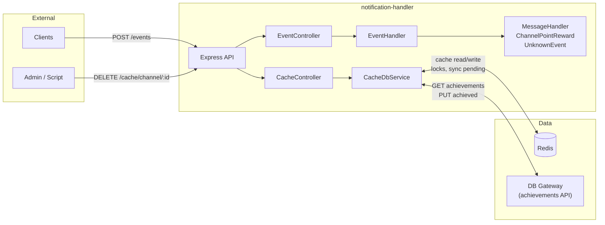
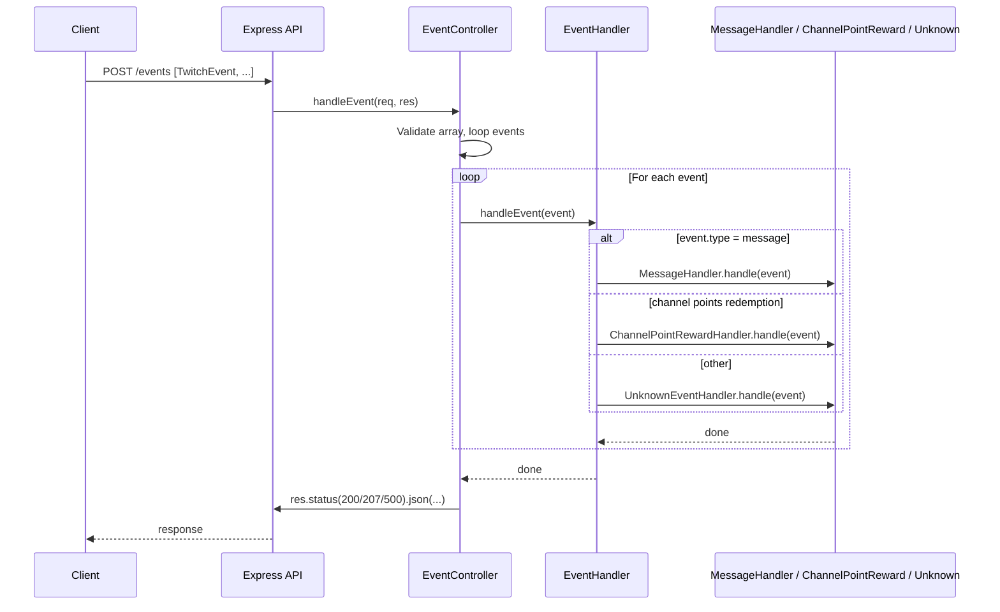

# notification-handler

HTTP service that receives Twitch events (messages, channel points), processes them, and uses a Redis cache for achievements (definitions and achieved per user/channel). A DB gateway is used for persistence; the cache can be cleared per channel after a database update to avoid serving stale data.

## How it works

### High-level architecture



- **Events:** Clients send Twitch events to `POST /events`. The request is validated, then each event is dispatched by type to the right handler (message, channel points, or unknown).
- **Cache:** Achievement data is read through `CacheDbService`: it uses Redis first; on miss it calls the DB Gateway, stores the result in Redis, then returns. Updates (e.g. progress) go to Redis and are marked for sync; when cache entries expire, pending changes are flushed to the DB. `DELETE /cache/channel/:channelId` clears all cache entries for that channel (achievements + user achieved lists).

### Event processing flow



### Cache & achievements flow

```mermaid
flowchart TB
  subgraph Read["Read path (e.g. getAchievements)"]
    R1["Request"] --> R2{"In Redis?"}
    R2 -->|Yes| R3["Return from cache"]
    R2 -->|No| R4["Lock, fetch from DB Gateway"]
    R4 --> R5["Store in Redis"]
    R5 --> R6["Return"]
  end

  subgraph Write["Update path"]
    W1["Update progress"] --> W2["Lock, update Redis\n(user_achieved)"]
    W2 --> W3["Add to sync set\n+ store sync data"]
  end

  subgraph Expiry["On cache expiry"]
    E1["refreshExpiredCacheEntries"] --> E2["For each pending key"]
    E2 --> E3["PUT /achieved to DB Gateway"]
    E3 --> E4["Remove sync data & key"]
  end

  subgraph Clear["Cache clear"]
    C1["DELETE /cache/channel/:id"] --> C2["Remove achievements:id\n+ all user_achieved:*:id"]
    C2 --> C3["Remove sync data & locks"]
  end
```



## Stack

- **Node.js** + **TypeScript**
- **Express** (REST API)
- **Redis** (achievements/achieved cache, locks, pending sync)
- **Winston** (logging)

## Prerequisites

- Node.js (version supported by the project)
- Redis
- Access to the DB Gateway (achievements API)

## Installation

```bash
npm install
cp .env.example .env
# Edit .env for your environment
```

## Environment variables

| Variable | Description | Default |
|----------|-------------|---------|
| `PORT` | Server port | `3000` |
| `NODE_ENV` | `development` / `production` / `test` | `development` |
| `ALLOWED_ORIGINS` | CORS origins (comma-separated) | `http://localhost:3000,http://localhost:8080` |
| `DB_GATEWAY_BASE_URL` | DB gateway base URL (achievements) | `http://localhost:8080` |
| `REDIS_URL` | Redis URL | `redis://localhost:6379` |
| `CACHE_TTL` | Cache TTL in seconds | `3600` |

## Scripts

| Command | Description |
|---------|-------------|
| `npm run dev` | Start the server in dev (`ts-node`) |
| `npm run build` | Compile TypeScript |
| `npm start` | Start the server (after `build`) |
| `npm test` | Run tests and coverage |
| `npm run test:coverage` | Run tests with detailed coverage report |
| `npm run test:ci` | Run tests in CI mode |

---

# API (Swagger-style)

Base URL: `http://localhost:3000` (or your deployment URL).

## Health

### GET /health

Service health check.

**Responses**

- **200 OK**

```json
{
  "status": "healthy",
  "timestamp": "2025-02-08T12:00:00.000Z",
  "environment": "development"
}
```

---

## Events

### POST /events

Submit a batch of Twitch events. Each event must have `id`, `type`, `source`, and `timestamp`. The body must be a non-empty array.

**Request**

- **Content-Type:** `application/json`
- **Body:** array of `TwitchEvent` objects

**TwitchEvent**

| Field | Type | Required | Description |
|-------|------|----------|-------------|
| `id` | string | yes | Event identifier |
| `type` | string | yes | Type (e.g. `message`, `channel.channel_points_custom_reward_redemption.add`, `channel.channel_points_automatic_reward_redemption.add`) |
| `source` | string | yes | Event source |
| `timestamp` | string | yes | Date/time (e.g. ISO 8601) |
| `version` | string | no | Payload version |
| `channelId` | string | no | Channel ID |
| `channelLogin` | string | no | Channel login |
| `userId` | string | no | User ID |
| `userLogin` | string | no | User login |
| `payload` | object | yes | Payload per type (message, channel points, etc.) |

**Example body (message)**

```json
[
  {
    "id": "evt-1",
    "type": "message",
    "source": "twitch",
    "timestamp": "2025-02-08T12:00:00Z",
    "payload": {
      "message": "Hello",
      "raw": "Hello"
    }
  }
]
```

**Example body (channel points custom reward)**

```json
[
  {
    "id": "evt-2",
    "type": "channel.channel_points_custom_reward_redemption.add",
    "source": "twitch",
    "timestamp": "2025-02-08T12:00:00Z",
    "channelLogin": "mychannel",
    "userId": "user123",
    "userLogin": "viewer",
    "payload": {
      "id": "redemption-id",
      "broadcaster_user_id": "broadcaster-id",
      "broadcaster_user_name": "mychannel",
      "user_id": "user123",
      "user_login": "viewer",
      "user_name": "Viewer",
      "user_input": "",
      "status": "fulfilled",
      "redeemed_at": "2025-02-08T12:00:00Z",
      "reward": {
        "id": "reward-id",
        "title": "My Reward",
        "cost": 100,
        "prompt": "Description"
      }
    }
  }
]
```

**Responses**

- **200 OK** – All events processed successfully

```json
{
  "status": "success",
  "processed": 2,
  "failed": 0,
  "results": [
    { "eventId": "evt-1", "status": "success" },
    { "eventId": "evt-2", "status": "success" }
  ]
}
```

- **207 Multi-Status** – At least one success and at least one failure

```json
{
  "status": "partial",
  "processed": 1,
  "failed": 1,
  "results": [{ "eventId": "evt-1", "status": "success" }],
  "errors": [
    {
      "eventId": "evt-2",
      "error": "Error message"
    }
  ]
}
```

- **400 Bad Request** – Invalid body (not an array or empty array)

```json
{
  "error": "Invalid request body",
  "message": "Expected an array of events"
}
```

or

```json
{
  "error": "Invalid request body",
  "message": "Events array cannot be empty"
}
```

- **500 Internal Server Error** – All events failed or server error

```json
{
  "status": "partial",
  "processed": 0,
  "failed": 1,
  "results": [],
  "errors": [{ "eventId": "evt-1", "error": "..." }]
}
```

or

```json
{
  "error": "Internal server error",
  "message": "Failed to process events"
}
```

---

## Cache

### DELETE /cache/channel/:channelId

Clears all cache for a channel: channel achievement definitions and all users’ achieved lists for that channel. Call after a database update for that channel to avoid serving stale data.

**Path parameters**

| Name | Type | Description |
|------|------|-------------|
| `channelId` | string | ID of the channel whose cache should be cleared |

**Responses**

- **204 No Content** – Cache cleared successfully (empty body)
- **400 Bad Request** – Missing `channelId`

```json
{
  "error": "Missing channelId",
  "message": "channelId is required"
}
```

- **500 Internal Server Error**

```json
{
  "error": "Internal server error",
  "message": "Failed to clear cache"
}
```

---

## Generic errors

- **404 Not Found** – Route or resource does not exist (default Express response for undefined routes).
